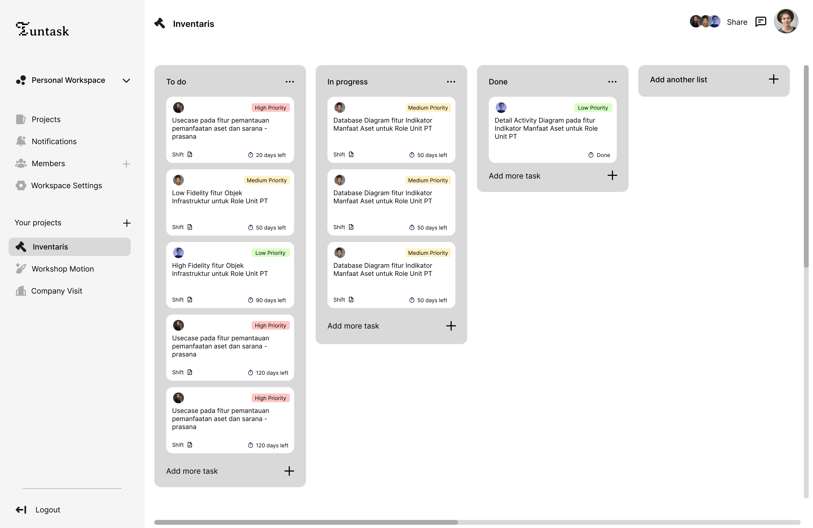
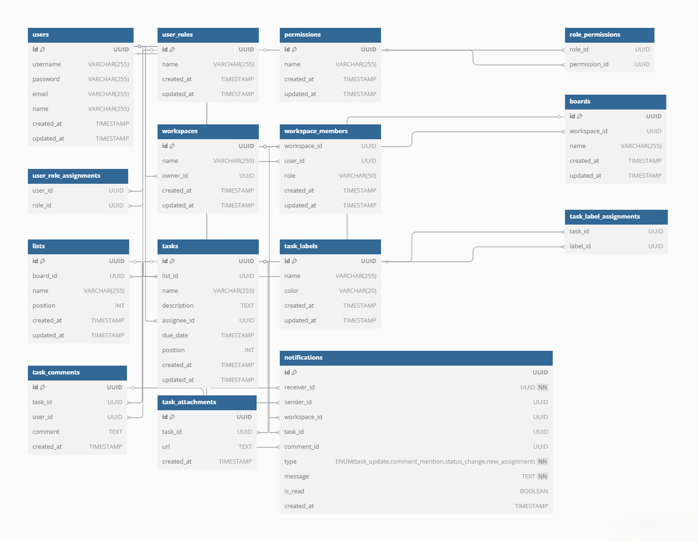

# Tuntask

## Tentang Tuntask

TunTask adalah platform manajemen tugas yang dikhususkan untuk himpunan atau organisasi kampus. Dirancang untuk membantu tim mengelola proyek, berkolaborasi, dan meningkatkan produktivitas dengan sistem yang terstruktur dan mudah digunakan.

## Referensi Website Sejenis

- **Notion** – Membantu pengguna mencatat, merencanakan proyek, dan berkolaborasi.
- **Trello** – Menyediakan sistem board untuk mengatur tugas secara fleksibel.
- **Monday.com** – Mengelola proyek dengan fitur kolaborasi yang kuat.
- **ClickUp** – Platform project management dengan fitur lengkap.
- **Jira** – Awalnya untuk bug tracking, kini digunakan untuk manajemen proyek.

## Mockup Halaman Utama

Halaman utama TunTask dirancang melalui beberapa tahapan desain:

## Desain Database Tuntask

### One-to-Many (1:N)

- **users → workspaces** (workspaces.owner_id → users.id)
- **workspaces → workspace_members** (workspace_members.workspace_id → workspaces.id)
- **users → workspace_members** (workspace_members.user_id → users.id)
- **workspaces → boards** (boards.workspace_id → workspaces.id)
- **boards → lists** (lists.board_id → boards.id)
- **lists → tasks** (tasks.list_id → lists.id)
- **users → tasks** (tasks.assignee_id → users.id)
- **tasks → task_comments** (task_comments.task_id → tasks.id)
- **users → task_comments** (task_comments.user_id → users.id)
- **tasks → task_attachments** (task_attachments.task_id → tasks.id)
- **users → notifications** (notifications.receiver_id → users.id)

### Many-to-Many (M:N)

- **users ↔ user_roles** (Pivot: user_role_assignments)
- **user_roles ↔ permissions** (Pivot: role_permissions)
- **tasks ↔ task_labels** (Pivot: task_label_assignments)

### Tabel Pivot

- **user_role_assignments** → Menghubungkan users dengan user_roles
- **role_permissions** → Menghubungkan user_roles dengan permissions
- **workspace_members** → Menghubungkan workspaces dengan users
- **task_label_assignments** → Menghubungkan tasks dengan task_labels
